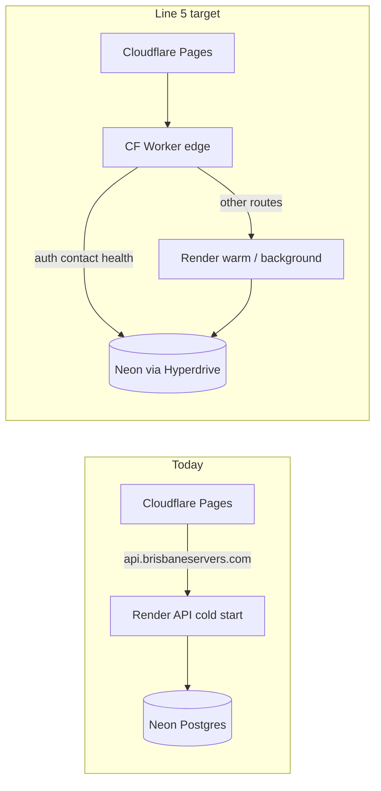

# Development line — brisbaneservers.com portal & API

**You are here:** Line **5 → ship** (edge + corpus live; portal UI + inference await git push to Pages/Render)

**End product map:** [END_PRODUCT.md](END_PRODUCT.md)

**Last updated:** 2026-06-06

This is the single roadmap for product + infra. **End product:** [END_PRODUCT.md](END_PRODUCT.md). Ops: [PRODUCTION_GO_LIVE_STATUS.md](../operations/PRODUCTION_GO_LIVE_STATUS.md). Edge: [EDGE_API_STATUS.md](../operations/EDGE_API_STATUS.md).

---

## Line map

```
0 ─── Foundation (site + Render API live)
│
1 ─── Auth & account portal (login, OAuth, /account shell)
│
2 ─── Content & marketing (resources, case studies, Brisbane 2032)
│
3 ─── Voice corpus & persistence (Neon, profiles, library APIs)
│
4 ─── Portal voice features
│     ├─ 4.1 Workspace UI + admin switcher        ✅ repo → ship Pages
│     ├─ 4.2 Voice map + Brisbane profile + lab   ✅ corpus on Neon → ship UI
│     ├─ 4.3 Free inference (Workers AI + caps)     ✅ repo → CF token on Render
│     ├─ 4.4 Edge contact + health                  ✅ LIVE
│     └─ 4.5 Edge auth (Hyperdrive)                 ✅ LIVE
│
5 ─── Ship & unify  ◄── CURRENT (git push → cohesive v1)
│
6 ─── Billing (PayID top-up → Stripe subscription)
│
7 ─── Legacy voice-framework parity (Markov, 3D topology) — backlog
```

**Legend:** ✅ done in repo · 🚀 live in prod · 🔧 active · ⏳ queued · ❌ not started

---

## Current position (detail)

| Line | Item | Repo | Production | Blocker |
|------|------|------|------------|---------|
| **4.2** | Voice map UI + corpus APIs | ✅ | ❌ | Push + Pages deploy |
| **4.2** | Brisbane default profile | ✅ | ✅ | Bootstrapped on Neon (16 resources, 48 chunks) |
| **4.2** | Workspace ↔ Admin switcher | ✅ | ❌ | Pages deploy |
| **4.3** | Workers AI inference | ✅ | ⚠️ partial | `CLOUDFLARE_API_TOKEN` on Render |
| **4.3** | `GET /api/usage/me` | ✅ | ❌ | Render deploy |
| **4.4** | Edge worker + contact + health | ✅ | ✅ | Live on `api.brisbaneservers.com` |
| **4.4** | `/api/auth/wake` + `/api/health/render` | ✅ | ✅ | Edge deployed |
| **4.5** | Auth on edge (login/register/me/logout) | ✅ | ✅ | Live via Hyperdrive |
| **5** | Route `api.brisbaneservers.com` → Worker | ✅ | ✅ | Proxied DNS + worker route |
| **6** | PayID / Stripe | ❌ | ❌ | After line 5 stable |

---

## Highest-leverage queue (do in order)

### Now (this week)

1. **Commit + push** all line 4.2–4.3 work → triggers Pages + Render deploy.
2. **`npm run configure:inference-workers-ai`** — paste Cloudflare Account ID + API token (free AI).
3. **`npm run configure:edge-worker`** — deploy worker, set secrets, route `api.brisbaneservers.com`.
4. **Prod corpus:** `/account` → Voice map → **Reindex** (or `npm run bootstrap:voice-corpus` with prod `DATABASE_URL`).

### Next (line 4.5 → 5)

5. **`npm run configure:hyperdrive`** — Neon pooled URL → Hyperdrive binding in `wrangler.toml`.
6. **`npm run configure:edge-worker`** — deploy worker + route `api.brisbaneservers.com`.
7. **`npm run verify:production-auth`** — login/register/me at edge (no Render cold start for auth).
8. **Keep OAuth/passkey on Render** initially; migrate later.

### Later (line 6–7)

9. PayID manual grant + daily cap top-up UI (Admin ops panel stub exists).
10. Stripe subscription when portal stable.
11. Markov / 3D topology from legacy `voice-framework/dashboard`.

---

## Architecture target



---

## Key commands

| Goal | Command |
|------|---------|
| Development line (this doc) | `docs/development/DEVELOPMENT_LINE.md` |
| Index voice corpus | `npm run bootstrap:voice-corpus` |
| Workers AI on Render | `npm run configure:inference-workers-ai` |
| Deploy edge worker | `npm run configure:edge-worker` |
| Hyperdrive (edge Postgres) | `npm run configure:hyperdrive` |
| Production smoke | `npm run verify:production` |
| Auth E2E | `npm run verify:production-auth` |

---

## Uncommitted work snapshot (2026-06-06)

Portal panels, voice-map APIs, Brisbane profile, inference lib, edge worker scaffold, ops docs. **Not on production until pushed.**

Render already has `INFERENCE_PROVIDER=workers-ai` from MCP; missing `CLOUDFLARE_ACCOUNT_ID` / `CLOUDFLARE_API_TOKEN` until configure script run.
