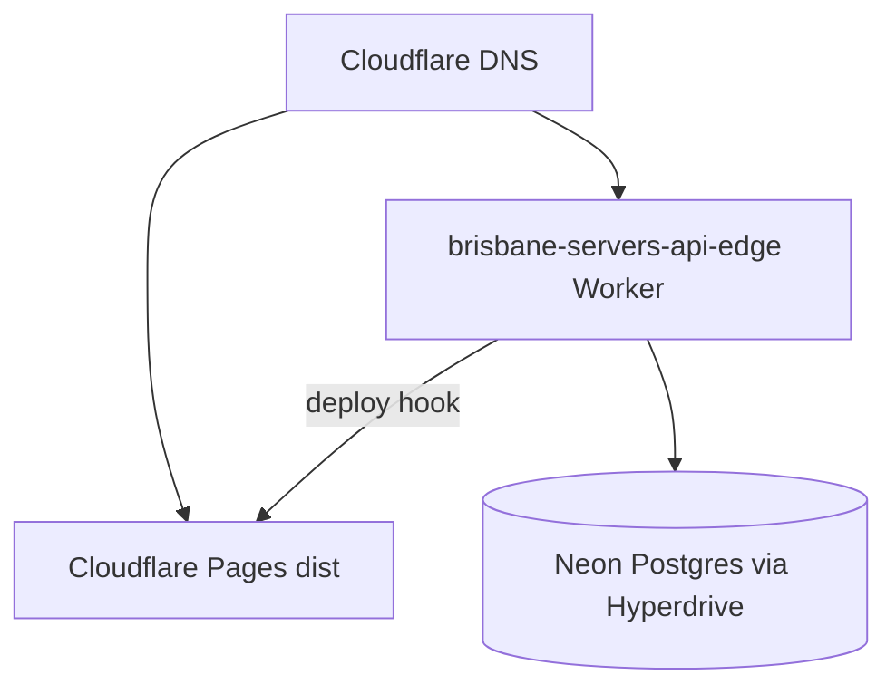

# Go-live runbook — domain-ready product

Cohesive checklist to connect **Cloudflare Pages** (public site) + **Node API** (auth, resources, growth) + **account workspace** at `https://brisbaneservers.com`.

**Linked hosting map (MCP):** [HOSTING_MCP_WORKSPACE.md](HOSTING_MCP_WORKSPACE.md)

> **2026-06-18:** Production API is the **Cloudflare Worker** at `https://api.brisbaneservers.com/api`. Render is retired. Phases below are historical; use [HOSTING_MCP_WORKSPACE.md](HOSTING_MCP_WORKSPACE.md) for current deploy/verify steps.

| Layer | Live |
|-------|------|
| Pages | `brisbaneservers` → https://brisbaneservers.com |
| API | Worker `brisbane-servers-api-edge` → https://api.brisbaneservers.com/api |
| Postgres | **Neon** via Hyperdrive on Worker |

**Canonical API URL:** `https://api.brisbaneservers.com/api`

---

## Phase 0 — Pre-flight (local)

```bash
cd website-brisbaneservers.com
npm run verify:go-live
```

Equivalent to `npm test` + `npm run typecheck` + `npm run build`. Expect: tests pass, post-build **6/6**.

Optional after API is live:

```bash
npm run verify:go-live -- --api https://<api-host>
```

- [ ] No secrets committed; copy [`.env.example`](../../website-brisbaneservers.com/.env.example) locally only.
- [ ] API URL chosen: `api.brisbaneservers.com` vs Render hostname.

---

## Phase 1 — API host

### Option A: Render Blueprint (repo root)

1. Render Dashboard → **New → Blueprint** → connect this repo → apply [`render.yaml`](../../render.yaml).
2. Service **`brisbane-servers-api`** — Node, `npm run start:api`, port **3002**.
3. Attach disk **`voice-storage`** → `voice-framework/storage` (persists JSON corpus).
4. Set dashboard secrets: `SMTP_*`, `CLOUDFLARE_PAGES_DEPLOY_HOOK_URL`, optional `ADMIN_EMAIL`/`ADMIN_PASSWORD` for bootstrap only.
5. `DATABASE_URL` links from **`brisbane-servers-db`** Postgres (blueprint).

```bash
# After deploy (replace host):
npm run verify:production -- --api https://brisbane-servers-api.onrender.com
```

### Option B: Manual Node host

- **Root:** monorepo checkout (not `website-brisbaneservers.com` alone).
- **Start:** `cd website-brisbaneservers.com && npm ci && npm run start:api`
- **Env:** see [`.env.production.example`](../../website-brisbaneservers.com/.env.production.example)
- **`MONOREPO_ROOT`:** absolute path to repo root (parent of `voice-framework/`).

### Admin seed

```bash
cd website-brisbaneservers.com
DATABASE_URL="postgresql://..." ADMIN_SEED_EMAIL=you@brisbaneservers.com ADMIN_SEED_PASSWORD='...' npm run seed:admin
```

### Verify

```bash
curl -sS https://<api-host>/api/health
curl -sS https://<api-host>/api/resources/public
cd website-brisbaneservers.com && npm run verify:production -- --api https://<api-host>
```

- [ ] Health returns success JSON.
- [ ] Sign up / login works against API (browser or curl).

---

## Phase 2 — Cloudflare Pages + domain

1. **Workers & Pages → Pages → Connect to Git**
2. Settings:

| Setting | Value |
|---------|--------|
| Root directory | `website-brisbaneservers.com` |
| Build command | `npm run build` |
| Build output | `dist` |
| Production branch | `main` |

3. **Production environment variables** (no secrets):

```env
PUBLIC_SITE_URL=https://brisbaneservers.com
PUBLIC_SITE_BASE=/
PUBLIC_API_BASE_URL=https://api.brisbaneservers.com/api
INTERNAL_API_BASE_URL=https://api.brisbaneservers.com/api
```

Use Render URL until `api.` DNS is ready. Remove `SKIP_HOSTED_API_CHECK` when API is live.

4. **DNS** (Cloudflare zone `brisbaneservers.com`):

| Record | Target |
|--------|--------|
| `@` | Cloudflare Pages |
| `www` | Redirect → apex |
| `api` | CNAME → Render service (proxied orange cloud) |

5. Deploy hook: Pages → Settings → Builds → **Deploy hooks** → copy URL → API host `CLOUDFLARE_PAGES_DEPLOY_HOOK_URL`.

- [ ] `https://brisbaneservers.com/` loads.
- [ ] `/robots.txt`, `/sitemap.xml`, `/privacy-policy/` OK.

---

## Phase 3 — Account workspace on domain

Open `https://brisbaneservers.com/account/` → DevTools → Network:

- [ ] Requests go to `PUBLIC_API_BASE_URL` (not `localhost`).
- [ ] Login + `/api/auth/me` succeed.
- [ ] Panels: Resources, Profiles, Analytics, Moderation, Site review.
- [ ] **Voice profiles:** set default (BIGPONS sync) — growth does **not** auto-create profiles.
- [ ] **Library growth:** Save settings → **Activate schedule** → optional **Run cycle now** → approve proposal.

---

## Phase 4 — SEO publish loop

1. API has `CLOUDFLARE_PAGES_DEPLOY_HOOK_URL`.
2. In workspace: publish a resource (or approve growth with publish).
3. Confirm Pages rebuild in Cloudflare dashboard.
4. After build: resource URL in `/sitemap.xml` if indexable.

```bash
curl -sS https://brisbaneservers.com/sitemap.xml | head -40
```

- [ ] Deploy hook fires on publish.
- [ ] At least one `/resources/item/{id}` in sitemap when indexable.

---

## Phase 5 — Library growth cron (optional)

**Requires schedule armed in workspace** (`scheduleArmed`).

**Option A — GitHub Actions** (`.github/workflows/library-growth-cron.yml`):

- Set repo secrets: `API_BASE_URL`, `CRON_SECRET`.

- [ ] Cron returns `success` when schedule armed; skips when paused.

---

## Phase 6 — Sign-off

Use [BRISBANESERVERS_PRODUCTION.md](BRISBANESERVERS_PRODUCTION.md) §5 and [PRODUCTION_CHECKLIST.md](../project/PRODUCTION_CHECKLIST.md).

| Check | URL |
|-------|-----|
| Home | https://brisbaneservers.com/ |
| Account | https://brisbaneservers.com/account/ |
| API health | `https://<api-host>/api/health` |
| Security | No default `admin123`; rotate bootstrap password |

Update [ACCOUNT_WORKSPACE_CHECKLIST.md](../portal/ACCOUNT_WORKSPACE_CHECKLIST.md) production table as items complete.

---

## Architecture reference



---

**Related:** [CLOUDFLARE_PAGES.md](CLOUDFLARE_PAGES.md) · [LIBRARY_GROWTH.md](../portal/LIBRARY_GROWTH.md) · [MASTER.md](../MASTER.md)
