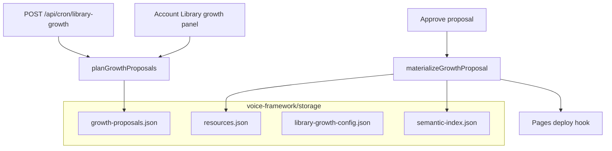

# Storage, vectors, and library growth (production)

How the **corpus**, **semantic index**, and **library growth** work on the hybrid stack (Cloudflare Pages + Render API).

**Live API:** `brisbane-servers-api` · **Postgres:** users/sessions only · **Corpus:** `voice-framework/storage/` on the API host.

---

## Two persistence layers

| Layer | Technology | What it stores | Survives API redeploy? |
|-------|------------|----------------|-------------------------|
| **Auth** | Render Postgres (`DATABASE_URL`) | Users, sessions, passkeys, audit | **Yes** |
| **Corpus + vectors** | JSON files under `voice-framework/storage/` | Resources, embeddings index, profiles, growth queue | **Only with persistent disk** |

`MONOREPO_ROOT` on Render is `/opt/render/project/src` (repo root). All corpus paths resolve to:

```text
/opt/render/project/src/voice-framework/storage/
```

---

## Corpus files (what matters)

| File | Role |
|------|------|
| `resources.json` | Published/draft resource library (guides, materials) |
| `semantic-index.json` | Chunk embeddings for `/api/semantic/search` and RAG |
| `profiles.json` | Voice profiles (BIGPONS, industry profiles) |
| `growth-proposals.json` | Library growth queue (pending → approve) |
| `library-growth-config.json` | Schedule settings + `scheduleArmed` flag |
| `pipeline-config.json` | Voice/auto-publish thresholds |
| `case-study-drafts.json` | Draft case studies from growth |
| `text-storage.json` / `vector-storage.json` | Legacy voice-framework helpers |

**Git seed:** `voice-framework/storage/resources.json` and `profiles.json` are committed as a baseline. On deploy, `npm run bootstrap:storage` copies seeds only when files are **missing** (never overwrites disk data).

---

## Vectors / semantic search

| Piece | Location |
|-------|----------|
| Index file | `semantic-index.json` |
| Indexing | `src/lib/semantic/pipeline.ts` after resource create/update |
| Search API | `POST /api/semantic/search` |
| Admin UI | Account → Vectors summary, Reindex resource |
| Embeddings | `EMBEDDING_PROVIDER=openai` + `OPENAI_API_KEY`, or **hash** fallback (dev-quality) |

Vectors are **not** on Cloudflare Vectorize today — they live on the API filesystem next to `resources.json`. **Reindex** after bulk imports or disk restore.

---

## Library growth flow



| Step | Who | Action |
|------|-----|--------|
| 1 | Admin | Library growth → **Save settings** (`enabled`, interval) |
| 2 | Admin | **Activate schedule** (`scheduleArmed: true`) — required for cron |
| 3 | Cron or manual | **Run cycle now** → fills `growth-proposals.json` |
| 4 | Admin | **Approve & generate** → writes `resources.json`, reindexes vectors |
| 5 | API | Optional `CLOUDFLARE_PAGES_DEPLOY_HOOK_URL` → rebuild static site |

**API routes** (admin bearer token unless cron):

- `GET/PATCH/POST /api/admin/library-growth`
- `GET/POST /api/admin/growth-proposals`
- `POST /api/cron/library-growth` + `Authorization: Bearer $CRON_SECRET`

---

## Render: ephemeral vs persistent

| Plan | Corpus on redeploy |
|------|-------------------|
| **Free** | **Lost** unless re-seeded from git bootstrap (runtime changes gone) |
| **Starter + disk** | **Survives** — mount `voice-storage` → `voice-framework/storage` |

### Enable persistent disk (recommended)

1. Render Dashboard → **brisbane-servers-api** → upgrade to **Starter** (disks require paid web service).
2. **Disks** → Add disk → mount path: `/opt/render/project/src/voice-framework/storage` (1 GB).
3. Redeploy. Run `npm run bootstrap:storage` once if empty (or let `prestart:api` do it).
4. In `/account`, sync default profile, run a test growth cycle, approve one proposal.
5. Redeploy again — corpus and vectors should still be present.

`render.yaml` documents the disk block; apply via Blueprint or mirror in the dashboard.

---

## Checklist to completion

| # | Task | Owner |
|---|------|--------|
| 1 | **Starter + disk** on `brisbane-servers-api` | Render dashboard |
| 2 | Deploy latest `main` (library growth APIs + bootstrap) | Git push / auto-deploy |
| 3 | `OPENAI_API_KEY` on API (optional, better vectors) | Render env |
| 4 | `CLOUDFLARE_PAGES_DEPLOY_HOOK_URL` | Cloudflare Pages → Deploy hooks |
| 5 | GitHub secrets `API_BASE_URL` + `CRON_SECRET` | Repo → Actions |
| 6 | Resend **domain verified** → `AUTH_EMAIL_FROM=support@...` | Resend + Render |
| 7 | `/account` → Library growth → Activate schedule → Run cycle | You |
| 8 | `npm run verify:production -- --api https://brisbane-servers-api.onrender.com` | Local |

---

## Related

- [LIBRARY_GROWTH.md](../portal/LIBRARY_GROWTH.md) — product detail
- [PRODUCTION_GO_LIVE_STATUS.md](PRODUCTION_GO_LIVE_STATUS.md) — phased status
- [HOSTING_MCP_WORKSPACE.md](HOSTING_MCP_WORKSPACE.md) — MCP map
