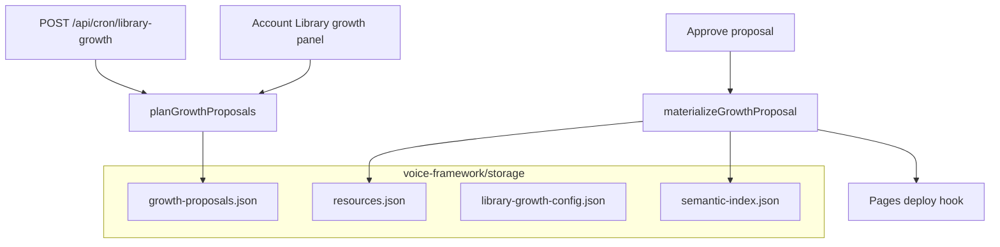

# Storage, vectors, and library growth (production)

How the **corpus**, **semantic index**, and **library growth** work on the production stack (Cloudflare Pages + **Worker API** + Neon).

**Live API:** `api.brisbaneservers.com` (Worker) · **Postgres:** Neon via Hyperdrive · **Corpus:** `corpus_documents` JSONB in Neon.

---

## Two persistence layers (one DATABASE_URL)

| Layer | Technology | What it stores | Survives API redeploy? |
|-------|------------|----------------|-------------------------|
| **Auth** | Postgres `DATABASE_URL` (**Neon recommended**) | Users, sessions, passkeys | **Yes** |
| **Corpus + vectors** | Same DB → `corpus_documents` JSONB | Resources, embeddings, growth, profiles | **Yes** |

**Production:** Neon via Hyperdrive on the Worker. Render Postgres is decommissioned.

### Corpus JSONB integrity

Each `corpus_documents` row must store a **jsonb array or object**, not a jsonb **string** (legacy double-encode). String blobs make loaders return empty data (e.g. Resource Tree shows “No resources yet” while rows exist).

| Command | Purpose |
|---------|---------|
| `npm run audit:corpus` | List missing keys, string-encoded blobs, shape mismatches |
| `npm run audit:corpus -- --repair --apply` | Repair string-encoded jsonb rows |

Code guards: `normalizeForJsonbStorage` on save, `coerceCorpusPayload` on load (`src/lib/corpus-store.ts`).

---

## Corpus files (what matters)

| File | Role |
|------|------|
| `resources.json` | Published/draft resource library (guides, materials) |
| `semantic-index.json` | Chunk embeddings for `/api/semantic/search` and RAG |
| `profiles.json` | Voice profiles (BIGPONS, industry profiles) |
| `growth-proposals.json` | Library growth queue (pending → approve) |
| `library-growth-config.json` | Schedule settings + `scheduleArmed` flag |
| `pipeline-config.json` | Voice/auto-publish thresholds |
| `case-study-drafts.json` | Draft case studies from growth |
| `text-storage.json` / `vector-storage.json` | Legacy voice-framework helpers |

**Git seed:** `voice-framework/storage/resources.json` and `profiles.json` are committed as a baseline. On deploy, `npm run bootstrap:storage` copies seeds only when files are **missing** (never overwrites disk data).

---

## Vectors / semantic search

| Piece | Location |
|-------|----------|
| Index file | `semantic-index.json` |
| Indexing | `src/lib/semantic/pipeline.ts` after resource create/update |
| Search API | `POST /api/semantic/search` |
| Admin UI | Account → Vectors summary, Reindex resource |
| Embeddings | `EMBEDDING_PROVIDER=openai` + `OPENAI_API_KEY`, or **hash** fallback (dev-quality) |

Vectors are **not** on Cloudflare Vectorize today — they live on the API filesystem next to `resources.json`. **Reindex** after bulk imports or disk restore.

---

## Library growth flow

| Step | Who | Action |
|------|-----|--------|
| 1 | Admin | Library growth → **Save settings** (`enabled`, interval) |
| 2 | Admin | **Activate schedule** (`scheduleArmed: true`) — required for cron |
| 3 | Cron or manual | **Run cycle now** → fills `growth-proposals.json` |
| 4 | Admin | **Approve & generate** → writes `resources.json`, reindexes vectors |
| 5 | API | Optional `CLOUDFLARE_PAGES_DEPLOY_HOOK_URL` → rebuild static site |

**API routes** (admin bearer token unless cron):

- `GET/PATCH/POST /api/admin/library-growth`
- `GET/POST /api/admin/growth-proposals`
- `POST /api/cron/library-growth` + `Authorization: Bearer $CRON_SECRET`

---

## Edge Worker + Neon (production)

| Setup | Corpus on redeploy |
|-------|-------------------|
| **Worker + Neon via Hyperdrive** | **Survives** in Postgres |
| **No Hyperdrive / no DATABASE_URL** | **Lost** — filesystem only, git seed on bootstrap |

See **[NEON_DATABASE.md](NEON_DATABASE.md)** for setup steps.

---

## Checklist to completion

| # | Task | Owner |
|---|------|--------|
| 1 | **Hyperdrive** → Neon pooled URL | `npm run configure:hyperdrive` |
| 2 | Deploy edge worker + Pages | `deploy:edge-worker`, git push |
| 3 | `OPENAI_API_KEY` on worker (optional, better vectors) | Worker secrets |
| 4 | `CLOUDFLARE_PAGES_DEPLOY_HOOK_URL` | Worker secret |
| 5 | Resend domain verified → `AUTH_EMAIL_FROM` | Resend + worker |
| 6 | `/account` → Library growth → Activate schedule | Admin |
| 7 | `npm run verify:production -- --api https://api.brisbaneservers.com` | Local |

---

## Related

- [LIBRARY_GROWTH.md](../portal/LIBRARY_GROWTH.md) — product detail
- [PRODUCTION_GO_LIVE_STATUS.md](PRODUCTION_GO_LIVE_STATUS.md) — phased status
- [HOSTING_MCP_WORKSPACE.md](HOSTING_MCP_WORKSPACE.md) — MCP map
