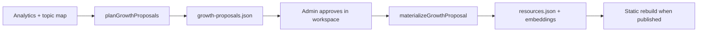

# Library growth — self-expanding resource corpus

The **account workspace** (`/account`) includes a **Library growth** panel (admin) that turns analytics and topic coverage into **approved, voice-aligned content** — the “growing library” described in product planning.

## What is automated vs manual (product intent)

| Automated (with admin approval) | Manual (account workspace) |
|---------------------------------|----------------------------|
| **Resources** — guide-style corpus entries in `resources.json` | **Voice profiles** — per industry, case study, or guide area (Profiles panel, create-base / edit) |
| **Case study materials** — narrative + linked resource; draft pages from `case_study` proposals | **Curated case study pages** — promote drafts into `case-studies.ts` when flagship-ready |
| **Topic coverage proposals** — planner queue from analytics gaps | **Static topic guides** — `src/data/topic-guides/*.ts` (optional; separate from API resources) |
| Semantic **indexing** of new content (embeddings on API host) | Choosing **default profile** used by growth (Profiles → set default) |

Library growth **does not** create, name, or persist new voice profiles for each case study or guide area. On approve, it generates **materials** using the **default site voice** (or bundled BIGPONS if no default is set). Create area-specific profiles yourself when you need a distinct voice.

## What exists today

| Layer | Role |
|-------|------|
| **Community contributions** | Public/authored input → pending queue → admin approve/reject (`/api/community/*`) |
| **Manual generate/upload** | Editors create resources in the Resources panel |
| **Analytics** | Topic metrics and pipeline suggestions (`/api/analytics/suggestions`) |
| **Library growth (new)** | Plans gaps → proposals queue → approve materializes via voice stack |

### Growth cycle flow



1. **Plan** — Compare `industries` topics vs published resources; boost priority when contributions are pending.
2. **Queue** — Store proposals in `voice-framework/storage/growth-proposals.json`.
3. **Approve** — Admin clicks **Approve & generate** → draft (or auto-publish if voice score ≥ threshold).
4. **Schedule** — Optional `intervalHours`. **Automatic cycles never run from config alone** — an admin must click **Activate schedule** in the account workspace (`scheduleArmed`). **Pause schedule** disarms; **Run cycle now** is always manual. Production options:

| Method | When to use |
|--------|-------------|
| **Account workspace** | Admin → Library growth → **Run cycle now** |
| **Cron HTTP** | `POST /api/cron/library-growth` with `Authorization: Bearer $CRON_SECRET` (Render cron, GitHub Actions) |
| **In-process** | `LIBRARY_GROWTH_SCHEDULER=1` on the standalone API process (15-minute due check) |
| **CLI** | `npx tsx scripts/library-growth-cycle.ts --due` on the API host |

```bash
cd website-brisbaneservers.com
npx tsx scripts/library-growth-cycle.ts --due
```

## API (admin, bearer token)

| Method | Path | Purpose |
|--------|------|---------|
| GET | `/api/admin/library-growth` | Config + pending preview |
| PATCH | `/api/admin/library-growth` | Update schedule/settings |
| POST | `/api/admin/library-growth` | Run cycle now (no body), or `{ "action": "arm" \| "pause" }` |
| GET | `/api/admin/growth-proposals?status=pending` | Full proposal list |
| POST | `/api/admin/growth-proposals` | `{ proposalId, action: "approve" \| "reject" }` |
| POST | `/api/cron/library-growth` | Due cycle when `CRON_SECRET` bearer matches (production cron) |

Register on hybrid hosts via `standalone-api/route-manifest.ts`. The standalone API server also auto-discovers routes under `api/`.

## Configuration

File: `voice-framework/storage/library-growth-config.json`

| Field | Meaning |
|-------|---------|
| `enabled` | Allow scheduling (settings only; does not auto-run) |
| `scheduleArmed` | **Physical activation** — cron/scheduler only when `true` |
| `scheduleArmedAt` / `scheduleArmedBy` | Audit when an admin activated the schedule |
| `intervalHours` | Hours between cycles (`0` = manual only) |
| `maxProposalsPerCycle` | Cap per run (1–20) |
| `generateCaseStudies` | Alternate proposal types |
| `autoPublishMinScore` | `null` = use pipeline `autoPublishThreshold` |

### Case study drafts

When a `case_study` proposal is approved, the API appends a draft to `voice-framework/storage/case-study-drafts.json`. Astro build merges those drafts into `src/data/case-studies.ts` when the file is on the build machine (local dev or committed export). Promote flagship narratives into the curated array in `case-studies.ts` when ready.

## De-duplication (v1)

Before voice generation, `getGrowthMaterializeBlockReason()` blocks:

- New **resource** proposals when a **published** resource already covers the same industry/topic
- Near-duplicate titles on the same topic
- Repeat **case_study** publish for the same topic

Phase 2: semantic vector similarity via `/api/semantic/search`.

## Roadmap (Phase 2+)

- **Author roles** — non-admin propose-only queue (reuse contributions pattern)
- **Semantic vector de-duplication** before materialize
- **Build-time fetch** of case-study drafts from the API for Cloudflare-only builds (no committed JSON)
- **Batch publish caps** and admin digest per cycle

## Cloudflare vs semantic / vectors

| Service | Role today |
|---------|------------|
| **Cloudflare Pages** | Static marketing site + account workspace shell |
| **Cloudflare deploy hook** | Rebuild Pages after API publish (SEO prerender) |
| **Cloudflare Email / DNS** | Optional receiving + DNS (see [CLOUDFLARE_EMAIL.md](../operations/CLOUDFLARE_EMAIL.md)) |
| **Cloudflare Vectorize / Workers AI** | **Not used** for the public site corpus today |

**Semantic index (account workspace + RAG):** chunk embeddings on the **standalone API host** — `semantic-index.json` (or SQLite), `EMBEDDING_PROVIDER` (`openai` or `hash` fallback). Admin surfaces: **Analytics**, **Vectors summary**, **Reindex resource** in `/account`. See [SEMANTIC_RUNBOOK.md](../operations/SEMANTIC_RUNBOOK.md).

Phase 2 could move embeddings to Cloudflare Vectorize; the admin panel would stay the control surface.

## Related

- [PORTAL.md](PORTAL.md) — workspace overview
- [VOICE_PORTAL_SCOPE_MAP.md](VOICE_PORTAL_SCOPE_MAP.md) — UI ↔ API map
- [MASTER.md](../MASTER.md) — hybrid deployment
