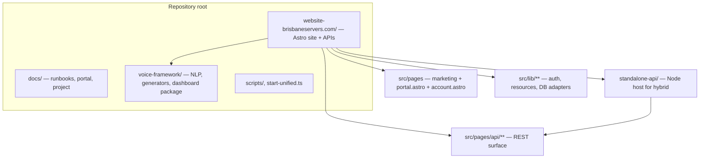
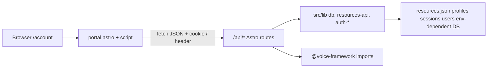

# Voice portal & repository scope map

**Purpose:** See the **whole monorepo** at a glance, then zoom into the **signed-in workspace** (`/account`, implemented by `portal.astro`) and the **backend routes** it calls. Use this when planning portal work or tracing a feature from UI to storage.

**Companion docs:** [PORTAL.md](PORTAL.md) (behaviour and features), [CODEBASE_WIRE_CARD.md](../project/CODEBASE_WIRE_CARD.md) (full architecture card), [PROJECT_NEXT_STEPS_REPORT.md](../development/PROJECT_NEXT_STEPS_REPORT.md) (priorities).

---

## 1. External visualization (quick wins)

These do not live in the repo but help you **see shape** before reading files.

| Tool | Use for |
|------|---------|
| **GitDiagram** | Replace `github.com` with `gitdiagram.com` in the repo URL for an interactive tree-style map of this GitHub project. |
| **VS Code Git Graph** (extension) | Branch/merge history and who touched what over time. |
| **Built-in Source Control graph** | Same machine as Cursor/VS Code — commit timeline without an extension. |
| **Gource** | Optional eye-candy: animated history of files and authors (good for demos, heavy setup). |

For **this** codebase, the diagrams and tables below are maintained **in-repo** so they stay aligned with `standalone-api/route-manifest.ts` and the actual file tree.

---

## 2. Monorepo at a glance



**One-line roles**

- **`voice-framework/`** — Shared package: analyzers, generators, profile manager, bundled voice data. Imported by website API routes and utils.
- **`website-brisbaneservers.com/`** — UI, Astro API routes, static build (`src-static/`). The account workspace is a **large single page** plus client script calling `/api/*`.
- **`standalone-api/`** — Re-exports the same Astro route modules for the **GitHub Pages hybrid** (browser → `PUBLIC_API_BASE_URL`). New API files must be registered in `standalone-api/route-manifest.ts` or hybrid clients will get 404.

**Terminal tree (depth 3, no `node_modules`):**

```bash
# From repo root (PowerShell)
Get-ChildItem -Directory -Depth 2 -Name | Select-Object -First 80
```

Or use your IDE file explorer with folders collapsed to `docs`, `voice-framework`, `website-brisbaneservers.com` only.

---

## 3. Account workspace (“voice portal”) — UI map

**Canonical URL:** `/account` (see [RUNNING_NOTES_MAP.md](../development/RUNNING_NOTES_MAP.md) for `/portal` redirects).

| File | Role |
|------|------|
| `website-brisbaneservers.com/src/pages/account.astro` | Thin re-export of `portal.astro` (same component tree). |
| `website-brisbaneservers.com/src/pages/portal.astro` | **Entire workspace UI:** login gate, sidebar, panels (dashboard, resources, profiles, analytics), inline styles, client script for `fetch('/api/...')`. |
| `website-brisbaneservers.com/src/lib/portal-voice-framework.ts` | Copy/rules constants for portal voice and resource/public interconnection messaging (not HTTP). |
| `website-brisbaneservers.com/src-static/pages/account.astro` | Static build entry that pulls in the same page for GitHub Pages output. |

**Logical panels** (DOM ids in `portal.astro`): `dashboard-panel`, `resources-panel`, `profiles-panel`, `analytics-panel`. Role-gated UI uses `data-min-role` (e.g. editor) where applicable.



---

## 4. Backend surface the portal uses

All paths are relative to the site origin in unified dev, or `PUBLIC_API_BASE_URL` in hybrid. The **standalone** server loads these via `website-brisbaneservers.com/standalone-api/route-manifest.ts` — keep that list in sync when adding routes.

### Auth & session

| Method | Path | Typical portal use |
|--------|------|---------------------|
| POST | `/api/auth/login` | Login form |
| POST | `/api/auth/logout` | Sign out |
| GET | `/api/auth/me` | Session bootstrap |
| POST | `/api/auth/register` | Self-serve signup (if enabled in UI) |
| POST | `/api/auth/verify-email`, `/api/auth/resend-verification` | Email verification |
| POST | `/api/auth/forgot-password`, `/api/auth/reset-password` | Password reset |
| POST | `/api/auth/revoke-all` | Kill all sessions |

### Resources (core hub)

| Method | Path | Notes |
|--------|------|--------|
| GET | `/api/resources` | List/filter (editor) |
| GET | `/api/resources/public` | Anonymous catalog rules |
| GET | `/api/resources/starter-blocks` | Starters |
| POST | `/api/resources/from-starter-block` | Fork starter |
| POST | `/api/resources/generate` | Voice-backed generation |
| POST | `/api/resources/process` | Paste/process pipeline |
| POST | `/api/resources/upload` | File upload path |
| GET/PUT/DELETE | `/api/resources/:id` | CRUD |
| POST | `/api/resources/:id/improve` | Improve flow |

Related: `related`, `seed`, `deduplicate`, `community-upload` — admin/editor workflows as implemented.

### Profiles & voice

| Method | Path | Notes |
|--------|------|--------|
| GET | `/api/profiles` | List profiles |
| GET/PUT/DELETE | `/api/profiles/:id` | Single profile |
| POST | `/api/profiles/create-base` | Base profile from starters |
| GET/POST | `/api/profiles/default` | Default profile pointer |

### Semantic, analytics, admin, community

- `/api/semantic/search` — search / RAG-style usage from portal when wired.
- `/api/analytics/suggestions` — suggestions panel.
- `/api/community/*` — contributions moderation.
- `/api/admin/*` — users, auth audit, pipeline config, reindex, vectors summary (role-protected).

### Health

- `GET /api/health` — liveness for ops and hybrid debugging.

---

## 5. Where backend logic lives (trace a feature)

| Concern | Primary locations |
|---------|-------------------|
| **HTTP handlers** | `website-brisbaneservers.com/src/pages/api/**/*.ts` |
| **Hybrid registration** | `website-brisbaneservers.com/standalone-api/route-manifest.ts` |
| **Auth** | `src/utils/auth.ts`, `src/lib/auth-*.ts`, `src/lib/db/auth-*.ts` |
| **Resources load/save** | `src/lib/resources-api.ts`, repositories under `src/lib/repositories/`, `resource-ingestion.ts`, `resource-voice-profile.ts` |
| **Voice generation / match** | Route files import `@voice-framework` (e.g. `TextGenerator`, `VoiceMatcher`, `Extrapolator`); `src/utils/voice-framework.ts` |
| **Storage paths** | `src/lib/storage-paths.ts` and `voice-framework/storage/` (JSON/SQLite depending on env) |

When something “works in dev but not on Pages,” check **CORS**, **`PUBLIC_API_BASE_URL`**, and that the route exists in **`route-manifest.ts`**.

---

## 6. “Where we are” vs “what’s next”

**Implemented (high level):** Auth flows, resource CRUD/generate/improve/upload/process, profiles including create-base, semantic and admin endpoints as present in the manifest, portal UI driving these via `fetch`.

**Not automatic:** End-to-end CMS-style publish without using the existing APIs; full production email and DB hardening — see [PROJECT_NEXT_STEPS_REPORT.md](../development/PROJECT_NEXT_STEPS_REPORT.md).

Update this file when you add a **new** `/api/*` route used by the portal, or when panel layout / entry URLs change.
