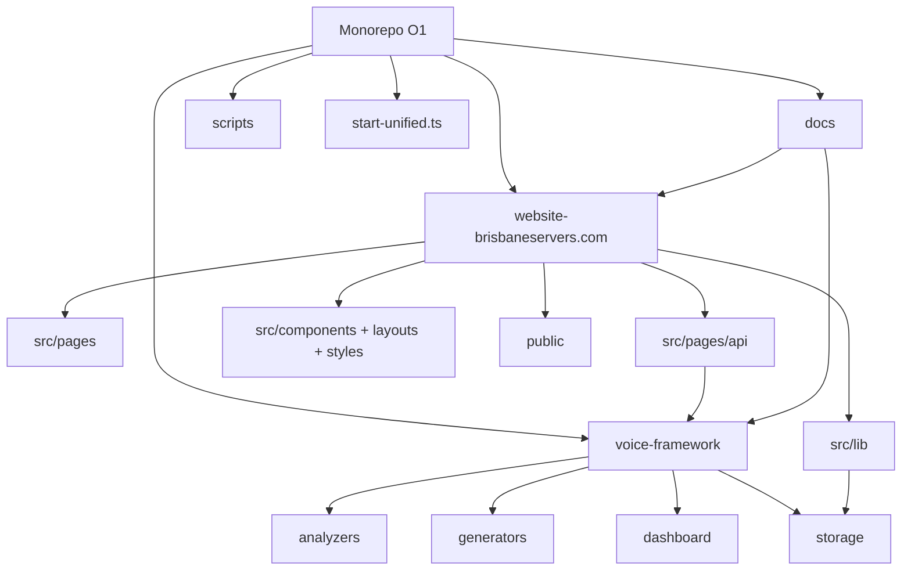
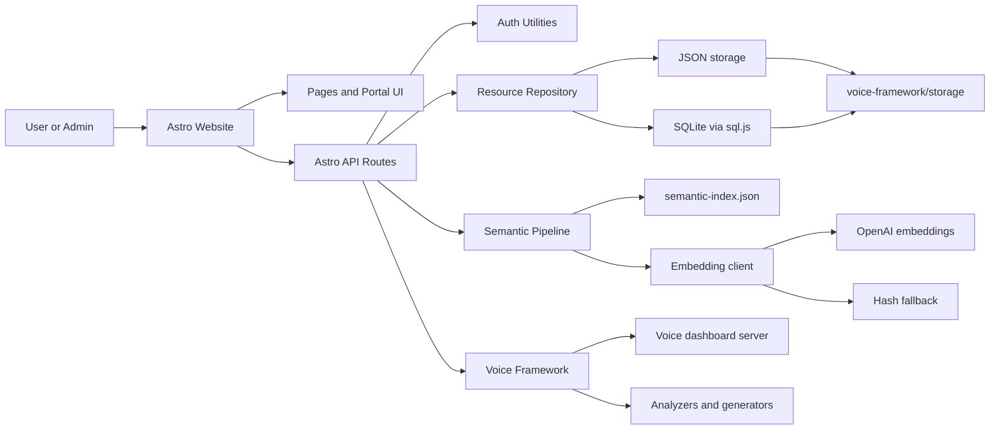
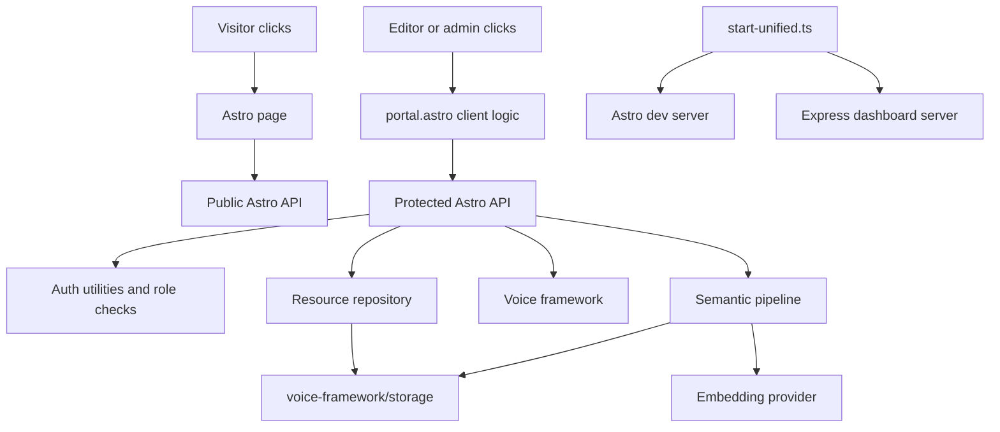
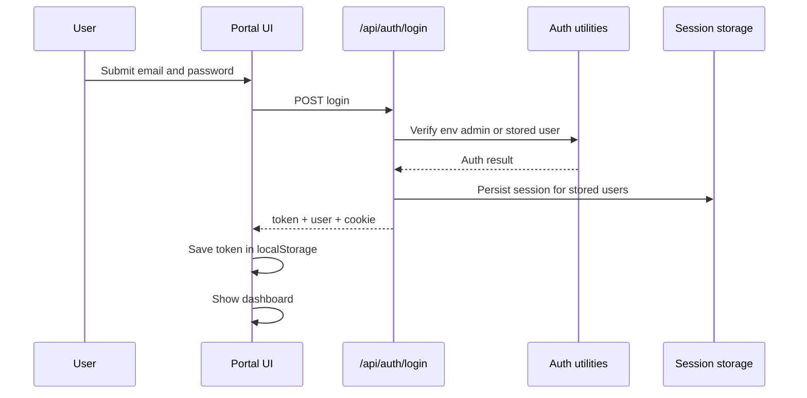
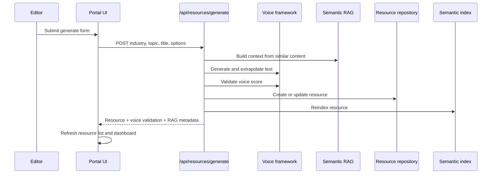
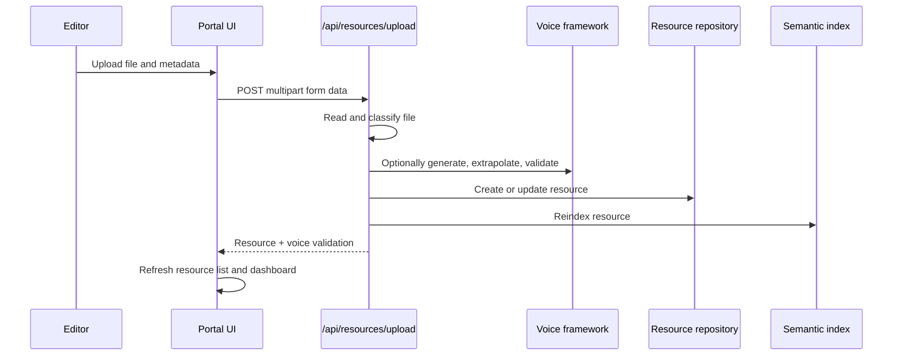
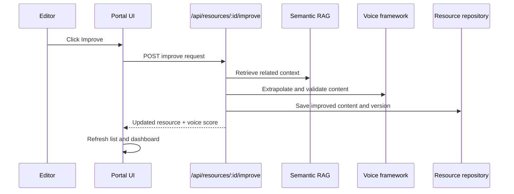

# Codebase Wire Card

Purpose: a fast architecture card for understanding how this repository is wired, what variants it supports, and where the main shortcomings likely are.

Scope: this document covers the monorepo at `O1/`, with emphasis on `website-brisbaneservers.com/`, `voice-framework/`, and `docs/`.

**Navigation:** the full Markdown index (paths, runbooks, archive) is [Documentation hub](../README.md).

Inference note: some conclusions below are inferred from code structure and configuration, not from running the full stack in production.

## Executive View

This repository is a monorepo with three practical layers:

- `website-brisbaneservers.com/` is the public site, authenticated portal, and Astro API surface.
- `voice-framework/` is the NLP and dashboard package that the website imports directly.
- `docs/` is the canonical documentation hub for operations, portal, design, and project notes.

The website is the operational center. It renders pages, serves API routes, stores data through JSON or SQLite repositories, and optionally calls semantic embedding flows. It is also tightly coupled to `voice-framework/` for generation, analysis, storage paths, and health checks.

## Repo Diagram

## Runtime Diagram

## Primary Packages

### `website-brisbaneservers.com/`

Role: public website, resources library, authenticated portal, Astro API server.

Important areas:

- `src/pages/` contains marketing pages, legal pages, resource pages, and `portal.astro`.
- `src/pages/api/` contains the main application API.
- `src/lib/` contains repositories, storage paths, semantic indexing, vectors, contributions, and rate limiting.
- `src/utils/` contains auth logic and voice-framework integration helpers.
- `scripts/` contains build-time validation and verification steps.

Framework and adapter:

- Default runtime is Astro server mode with `@astrojs/cloudflare`.
- Alternate runtime is Astro server mode with `@astrojs/node` using `astro.config.cpanel.mjs`.

### `voice-framework/`

Role: voice analysis and generation engine plus a separate dashboard server.

Important areas:

- `analyzers/` and `generators/` provide the main NLP capabilities.
- `dashboard/` exposes an Express app and route groups.
- `storage/` acts as the practical state directory used by the website package.

This package is both a sibling app and a dependency-like internal module.

### `docs/`

Role: canonical documentation entry point.

Important areas:

- `operations/` for runbooks and troubleshooting.
- `portal/` for portal behaviour and credentials.
- `project/` for architecture, contracts, checklists, and status.
- `development/` and `design/` for configuration and design system notes.

## Route and Feature Map

### Public site

- Marketing pages such as `index`, `about`, `services`, and `projects`
- Case studies
- Legal pages
- Dynamic sitemap and robots endpoints

### Resource library

- `resources.astro`
- Dynamic topic and industry pages
- Resource item pages
- Public resource APIs

### Portal

- `portal.astro`
- Authenticated admin/editor workspace
- Resource management, uploads, generation, starter blocks, and improvement flows

### API groups

- `api/auth/*` for login, logout, register, and current user
- `api/resources/*` for CRUD, upload, generation, processing, related resources, and community upload
- `api/profiles/*` for profile management
- `api/community/*` for moderation and contribution views
- `api/semantic/*` for semantic search
- `api/admin/*` for vector and pipeline administration
- `api/analytics/*` for suggestion endpoints
- `api/tokens/*` for token views
- `api/health` and `api/test` for operational checks

## Variations

### Variation 1: deployment model

| Variant | Main config | Intended target | Implication |
|---|---|---|---|
| Cloudflare default | `website-brisbaneservers.com/astro.config.mjs` | Workers or Pages style server runtime | Best aligned with edge deployment, but clashes with local filesystem persistence |
| cPanel or Node standalone | `website-brisbaneservers.com/astro.config.cpanel.mjs` | Traditional Node hosting | Better aligned with filesystem-backed JSON or SQLite storage |

### Variation 2: storage model

| Variant | Selector | Backing store | Notes |
|---|---|---|---|
| JSON repository | `RESOURCE_STORAGE=json` or default | `voice-framework/storage/resources.json` and sibling JSON files | Easiest local setup, weakest for concurrency and scaling |
| SQLite repository | `RESOURCE_STORAGE=sqlite` | `voice-framework/storage/resources.db` via `sql.js` | Better structure, but still bound to local file durability |

Related persisted files inferred from the website package:

- `resources.json`
- `semantic-index.json`
- `resources.db`
- `users.json`
- `sessions.json`
- `contributions.json`
- `token-ledger.json`
- `vectors.json`

### Variation 3: auth model

| Variant | Source | Session behaviour | Notes |
|---|---|---|---|
| Env bootstrap admin | `ADMIN_EMAIL` and `ADMIN_PASSWORD` | Token created in memory | High convenience, fragile in multi-instance or worker environments |
| Registered users | `users.json` plus `sessions.json` | Persisted session path exists | Better than memory-only, but still file-backed |

Roles present in code:

- `super-admin`
- `admin`
- `editor`
- `viewer`
- `client`

### Variation 4: semantic search mode

| Variant | Trigger | Provider | Notes |
|---|---|---|---|
| Full embeddings | OpenAI key configured | Remote embedding API | Higher quality, external dependency, cost exposure |
| Fallback embeddings | No OpenAI or configured hash mode | Local hash embedding | Lower fidelity, but keeps the pipeline operable |

Semantic flow:

1. Chunk resource content.
2. Generate an embedding.
3. Store vectors in `semantic-index.json`.
4. Search by cosine similarity.
5. Assemble RAG context for improvement or generation flows.

### Variation 5: UI surface

| Variant | Audience | Primary implementation |
|---|---|---|
| Public marketing site | Visitors | Astro pages and static assets |
| Resource discovery site | Visitors | Astro pages plus public API endpoints |
| Portal workspace | Editors, admins, clients | Large single Astro page with extensive client-side fetch logic |
| Voice dashboard | Separate internal tooling | Express app inside `voice-framework/dashboard/` |

### Variation 6: repository boundary

| Variant | Description | Trade-off |
|---|---|---|
| True monorepo usage | Open and run from repo root | Everything resolves, but coupling is high |
| Package-only usage | Open only `website-brisbaneservers.com/` | Likely broken without sibling `voice-framework/` and shared storage paths |

## Wiring Summary

The real dependency direction is:

1. Users hit Astro pages or Astro API routes.
2. Astro API routes depend on shared auth and repository helpers.
3. Repositories depend on local JSON or SQLite files under `voice-framework/storage/`.
4. Semantic routes depend on chunking, embeddings, and vector index files.
5. Several website endpoints also depend directly on `voice-framework/` analyzers, generators, or dashboard utilities.

This means the website package is not isolated. It behaves like the application shell for a wider local-platform architecture.

## Conjunction Map

The main conjunctions, meaning the handoff points where one subsystem crosses into another, are:

1. Page render to API route
2. Portal click to client-side handler
3. API route to auth policy
4. API route to repository and storage
5. API route to voice framework
6. API route to semantic indexing
7. Semantic pipeline to remote embedding provider
8. Unified startup script to both Astro and Express processes

## Variation By Actor

| Actor | Entry point | Main clicks | Main effect |
|---|---|---|---|
| Public visitor | `/` | Explore solutions, view resources, open industry pages | Navigates through marketing and public resource surfaces |
| Resource reader | `/resources` | Search, filter by industry, open topic or resource cards | Reads published resource content assembled from public API data |
| Portal editor | `/portal` | Login, generate, upload, improve, edit, publish | Mutates resources and can trigger semantic indexing |
| Portal admin | `/portal` | All editor actions plus analytics and moderation flows | Uses broader management and admin-only endpoints |
| Internal operator | repo root | `npm start` | Starts Astro website and Express dashboard together |

## Variation By Operational Intent

| Intent | Frontend surface | Primary backend path | Data touched |
|---|---|---|---|
| Discover content | Public pages | `GET /api/resources/public` | Published resources only |
| Authenticate | Portal login | `POST /api/auth/login` | In-memory token and possibly `sessions.json` |
| List working content | Portal dashboard and resources panel | `GET /api/resources` | Resource repository |
| Create from template | Starter blocks | `POST /api/resources/from-starter-block` | Resources plus possibly profiles |
| Generate new content | Generate form | `POST /api/resources/generate` | Resources, semantic index, voice score |
| Upload source material | Upload form | `POST /api/resources/upload` | File content, resources, semantic index |
| Improve existing content | Resource actions | `POST /api/resources/:id/improve` | Existing resource, semantic index |
| Change publication state | Resource actions | `PUT /api/resources/:id` | Resource status |
| Remove content | Resource actions | `DELETE /api/resources/:id` | Resource deletion |
| Manage voice profile | Profiles panel | `GET /api/profiles`, `POST /api/profiles/create-base` | `profiles.json`, default profile files |
| Review analytics | Analytics panel | `GET /api/analytics/suggestions` | Analytics summary and admin suggestions |

## Click Basis Of Operations

This section translates visible user actions into actual code operations.

### Public clicks

| Visible click | Frontend behaviour | Backend behaviour | Persistence | Notes |
|---|---|---|---|---|
| Home `Explore Solutions` | Scrolls to services section | None | None | Pure page interaction |
| Home industry card | Navigates to `/resources/{industry}` | Page resolves through Astro route | None directly | Read-only path |
| Home `View All Resources` | Navigates to `/resources` | `resources.astro` fetches public resources server-side | None directly | Public discovery entry |
| Resource card on `/resources` | Opens topic or item page | Page reads published resources through public API | Published resource store | Public read model depends on API health |
| Topic card | Opens `/resources/{industry}/{topic}` | Dynamic page resolves topic-specific content | Published resources | Industry taxonomy drives navigation |

### Portal clicks

| Visible click | Client handler | API route | Server-side work | Persistence or state update |
|---|---|---|---|---|
| Submit login form | Fetch with email and password | `POST /api/auth/login` | Checks env admin first, then stored users | Token in `localStorage`, cookie, memory session, possibly `sessions.json` |
| Logout | `handleLogout()` | `POST /api/auth/logout` | Invalidates session path where possible | Clears local token |
| Open Dashboard nav | `navigateToPanel('dashboard')` | `GET /api/resources` | Loads all accessible resources and computes client stats | In-memory page state only |
| Refresh dashboard | `loadDashboardData()` | `GET /api/resources` | Reloads accessible resources | In-memory page state only |
| Open Resources nav | `navigateToPanel('resources')` | `GET /api/resources` or starter block endpoint | Loads tree or list data | In-memory page state only |
| Search in portal | Search listeners call `loadResources()` | `GET /api/resources` | Filters server payload and client view | In-memory page state only |
| Toggle tree item | `toggleTreeNode()` | None | Expands or collapses DOM tree | UI state only |
| Click resource in tree | `selectResource(id)` | None immediately | Loads detail panel from already-fetched data | UI state only |
| View full resource | `viewResource(id)` | None immediately | Opens modal from current resource cache | UI state only |
| Edit resource then save | Edit modal submit | `PUT /api/resources/:id` | Updates resource fields | Resource repository and storage files |
| Publish resource | `publishResource(id)` | `PUT /api/resources/:id` | Sets status to `published` | Resource repository |
| Unpublish resource | `unpublishResource(id)` | `PUT /api/resources/:id` | Sets status to `draft` | Resource repository |
| Archive resource | `archiveResource(id)` | `PUT /api/resources/:id` | Sets status to `archived` | Resource repository |
| Delete resource | `deleteResource(id)` | `DELETE /api/resources/:id` | Removes stored record | Resource repository |
| Improve resource | `improveResource(id)` | `POST /api/resources/:id/improve` | Builds RAG context, extrapolates, validates voice, reindexes | Resource repository plus semantic index |
| Generate resource | Generate form submit | `POST /api/resources/generate` | Uses voice framework, RAG, duplicate prevention, validation, indexing | Resource repository plus semantic index |
| Upload and process | Upload form submit | `POST /api/resources/upload` | Reads file, classifies upload, may generate and extrapolate, validates voice, indexes | Resource repository plus semantic index |
| Starter block card `Use This Block` | `createFromStarterBlock(id)` | `POST /api/resources/from-starter-block` | Creates a user resource from template; may create base profile | Resource repository, sometimes profile files |
| Starter block `Preview` | Navigate then `selectResource(id)` | None immediately | Reads already-fetched starter block in client | UI state only |
| Create base profile | `createBaseProfile()` | `POST /api/profiles/create-base` | Aggregates starter blocks, builds or updates default profile | `profiles.json` and default profile path |
| Load profiles panel | `loadProfiles()` | `GET /api/profiles` | Reads profile metadata and default profile | Profile files only |
| Load analytics panel | `loadAnalytics()` and suggestions call | `GET /api/analytics/suggestions` | Computes admin suggestions | Derived analytics, mostly read path |

## Click Sequences

### Sequence 1: portal login

### Sequence 2: generate resource

### Sequence 3: upload resource

### Sequence 4: improve existing resource

## Operational Junctions Down To UI Basis

These are the most important junction types to keep in mind when documenting or refactoring:

### Junction 1: page to page

- Marketing navigation is mostly static and route-driven.
- Public resource discovery bridges static navigation with server-side API reads.
- Portal navigation is mostly client-side panel switching inside one very large page.

### Junction 2: client state to server state

- Portal tree selection, view toggles, modal opens, and filters are local UI state.
- Generate, upload, improve, publish, edit, archive, and delete all cross into persisted server state.

### Junction 3: website package to voice framework package

- Generation uses voice framework generators and matchers.
- Upload processing can create content using voice framework profile-aware components.
- Health and profile functionality also cross package boundaries.

### Junction 4: website package to storage

- Resource CRUD writes under the sibling `voice-framework/storage/` tree.
- Sessions and users are also file-backed.
- Profiles are loaded from voice-framework profile files.

### Junction 5: resource operations to semantic operations

- Generate and upload both write the resource and then reindex it.
- Improve regenerates content and reindexes it.
- Public related-resource discovery can invoke embedding logic.

## Operational Shortcomings By Click Path

This reframes shortcomings around what a user or operator actually does.

| Click path | Inferred weakness | Why it matters |
|---|---|---|
| Login | Default fallback credentials and mixed session storage | A high-risk entry path is also a foundational trust boundary |
| Dashboard load | Depends on authenticated resource listing on every refresh | Repeated broad reads can become the main operational dependency |
| Generate | Single request performs generation, validation, dedupe, save, and indexing | Long synchronous path raises latency and failure-surface complexity |
| Upload | File ingest, optional generation, voice validation, and indexing happen together | One action bundles multiple responsibilities and increases brittleness |
| Improve | Content rewrite and semantic retrieval happen in one mutation path | Errors or low-quality context can directly affect published editorial material |
| Publish | Simple status change controls public visibility | A small click has large user-facing impact, so policy and auditability matter |
| Profiles | Profile files live outside the website package boundary | Operational ownership is blurred |
| Analytics | Admin-only but depends on broader content state quality | Weak content hygiene can degrade recommendations |

## Better Forthcoming

If this codebase is being prepared for stronger future operation, the most helpful next architectural moves are:

1. Separate UI-local actions from server-mutating actions in the portal code and document each boundary explicitly.
2. Break long synchronous mutation flows into smaller jobs or queued stages.
3. Replace file-backed sessions and resource persistence with infrastructure that matches the chosen deployment target.
4. Introduce an explicit service layer for portal operations rather than binding many clicks directly to fetch calls inside one page.
5. Add an audit trail around publish, delete, improve, and profile-changing actions.
6. Define one canonical operational diagram per environment: local, Node production, and edge production.

## What Is Strong

- The repository has a clear top-level separation between site, framework, and docs.
- The website has meaningful internal structure: pages, API routes, repositories, semantic logic, and supporting utilities are separated.
- The docs folder is already treated as a canonical home for operational knowledge.
- The voice framework is a recognizable subsystem rather than scattered logic.
- There is explicit support for more than one deployment target.

## Shortcomings

Ordered by practical impact, with inference where needed.

### Critical

1. Default admin credentials appear to exist when env vars are missing.
2. The default website runtime is Cloudflare, while most persistence assumes writable local files.
3. Session state is partly memory-only, which is brittle for workers, restarts, and horizontal scale.

### High

1. Registration appears open without strong anti-abuse controls.
2. Some public routes can trigger semantic or embedding work, which can create quota and cost risk.
3. Rate limiting is implemented in-process, which weakens protection in distributed deployment.
4. Auth cookies appear to omit `Secure`.
5. Health and test routes may expose unnecessary operational detail.

### Medium

1. The website is tightly coupled to a sibling package through aliases and shared storage paths.
2. `portal.astro` appears to be a very large client-heavy page with many direct fetch calls, raising maintainability risk.
3. API authorization rules are spread across many endpoints rather than centralized through a stronger middleware or policy layer.
4. The repo advertises production readiness in some docs, but the current website architecture suggests unresolved deployment and security ambiguity.

### Low

1. There is no strong first-party automated test story visible for the website package.
2. Build artifacts and generated output are present locally, which can make architecture review noisier.
3. Package-local documentation appears weaker than repo-level documentation, especially for contributors entering from the website folder alone.

## Gaps Between Documentation and Implementation

These are especially worth reviewing:

- Docs present the repo as broadly production-ready, but the website runtime and persistence model are still in tension.
- The website package is described like an app, but in practice it also depends on a sibling framework package and its storage tree.
- The architecture is partly dual-platform: edge-first configuration, Node-style storage assumptions, and a separate Express dashboard.

## Suggested Next Corrections

1. Pick and document one canonical production runtime.
2. Move auth sessions and resource persistence to infrastructure that matches that runtime.
3. Remove default credentials and require secure env configuration.
4. Break `portal.astro` into smaller client modules or components.
5. Add contract tests for auth, repositories, and semantic endpoints.
6. Publish one definitive architecture doc and keep status docs aligned with it.

## Fast Read

If you only need the shortest description:

- This is a monorepo where the Astro website acts as the main app shell.
- It serves both content and APIs, but it also depends directly on a sibling voice framework package.
- The code supports multiple runtime and storage variations, though not all combinations are equally sound.
- The biggest weaknesses are deployment-model mismatch, session and storage durability, and maintainability of the portal and API surface.
